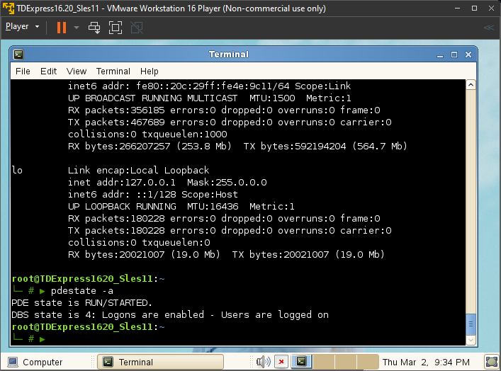
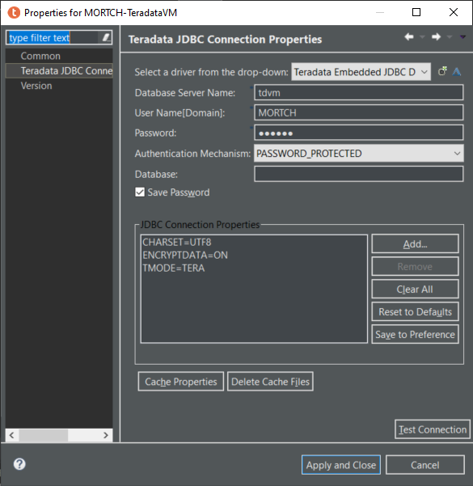
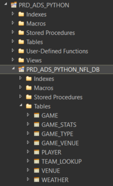
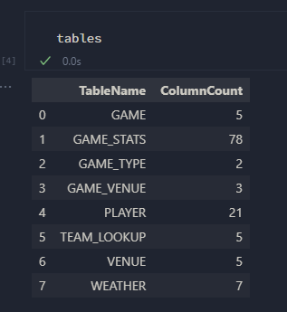
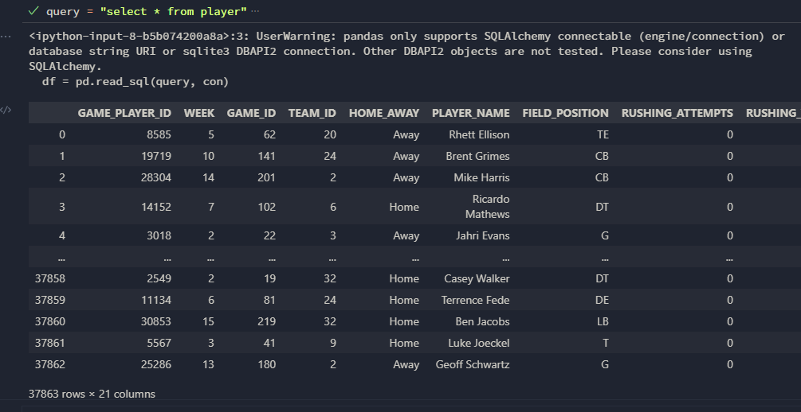

# Reading and Writing data between Python and Teradata

## Local Python environment setup

For this run through I am using:

- Python 3.8.10
- installed on Windows Subsystem for Linux

Create a new virtual environment and install the requirements.

```sh
python3 -m venv tdml
pip install -r requirements.txt
python3 -m ipykernel install --user --name tdml --display-name tdml
```

## Teradata

I am using a Teradata Express 16.20 virtual machine running with VMWare Workstation Player 16.2.5.
Our hosts file is mapping the virtual machine's IP address to `tdvm`

```conf
 cat /etc/hosts
# This file was automatically generated by WSL. To stop automatic generation of this file, add the following entry to /etc/wsl.conf:
# [network]
# generateHosts = false
127.0.0.1       localhost
192.168.190.128 tdv
```



### Setup database structures

This step is oviously not required, however it is here for completeness sake.
Running the `teradata-setup.sql` script to create the required database and provide access to the appropriate user.

### Setup the table structures

Firstly test connecting to it from Teradata Studio IDE:



Runing this (`python-nfl-ddl.sql`) SQL script in you favourite SQL IDE (for example Teradata Studio).



## Python execution in VSCode

I'm going to using Python interactive in VSCode to run this. In this mode we can run the "Cells" (blocks of code between `# %%` seperately and view tabular results in a more visual way).

For example, running the `python-teradata.sql` script up until this point and then in the interactive window typeing `table` and hitting `shift-enter`.

```py
# %%
query = f"""
select
  TableName
  , count(*) as ColumnCount
from
  dbc.columnsv
where
  databasename='{database}'
group by
  TableName
order by
  TableName
"""
tables = pd.read_sql(query, con)
```



Now running the remainder of the script (before the truncation part) we sucessfully load the tables from the CSV files and can test querying one of the loaded tables.


