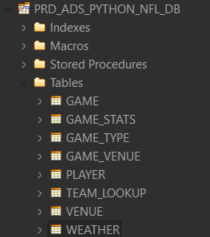
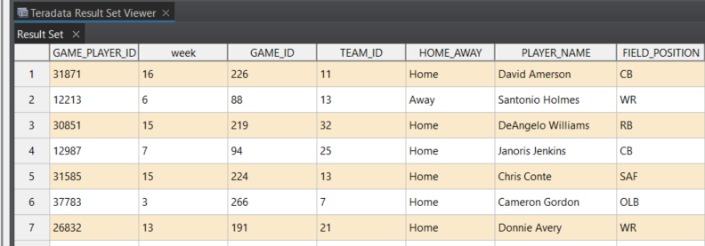

# PyTPT - Python Teradata TPT CSV Loading

A simple Python library for loading CSV files to Teradata using TPT.

## Usage

I have test this and it is working on both Windows and Linux.

### Prerequisites

- A Teradata machine (I am using a TD Express VM)
- Teradata Studio (not required but best to check results)
- Teradata Tools and Utilities (TTU, which includes the required binary `tbuild` for TPT)
  
```ps1
# Create your python virtual environment
# Linux
python -m venv ~/venv/pytpt
source ~/venv/pytpt/bin/activate
# Windows
python -m venv C:\venv\pytpt
C:\venv\pytpt\Scripts\Activate.ps1
# Install poetry and then packages
pip install poetry
poetry install
```

Assuming you have set your configuration to the correct database and tables in `conf/database/<databasename>.yaml:

```yaml
# @package _global_
# Teradata NFL database configuration

database:
  ddl_host: "tdvm"
  target_host: "tdvm"
  working_database: "PRD_ADS_PYTHON_NFL_DB"
  name: "PRD_ADS_PYTHON_NFL_DB"
  ddl_logmech: "TD2"
  target_logmech: "TD2"

# Table configurations for NFL data
tables:
  game: "GAME"
  game_type: "GAME_TYPE"
  game_stats: "GAME_STATS"
  game_venue: "GAME_VENUE"
  player: "PLAYER"
  venue: "VENUE" 
  team_lookup: "TEAM_LOOKUP"
  weather: "WEATHER"
```

and you project level configuration in `conf/config.yaml`:

```yaml
# Main configuration file for pytpt examples
# This file sets up the default configuration structure

defaults:
  - database: PRD_ADS_PYTHON_NFL_DB
  - _self_

# Data directory configuration
data:
  dir: "../../data"
```

Just run:

```ps1
python app.py
```



